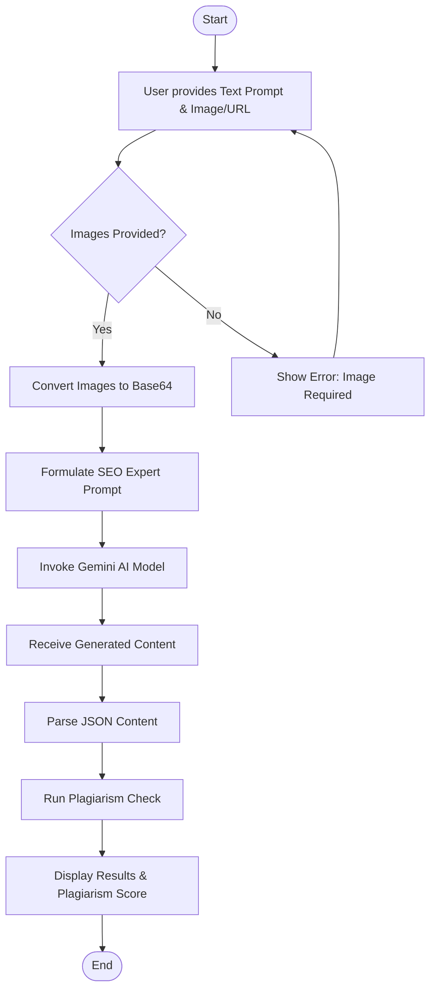
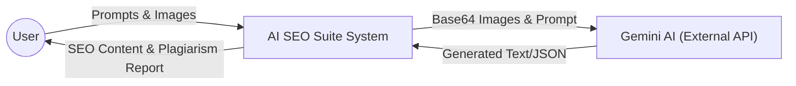
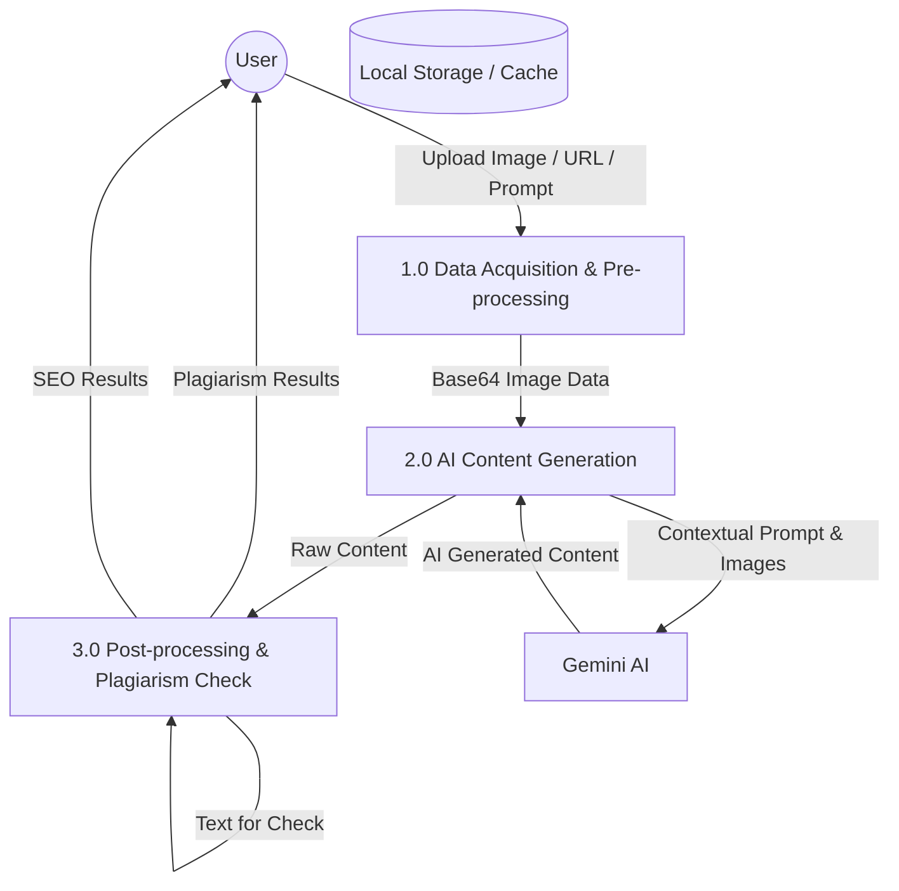
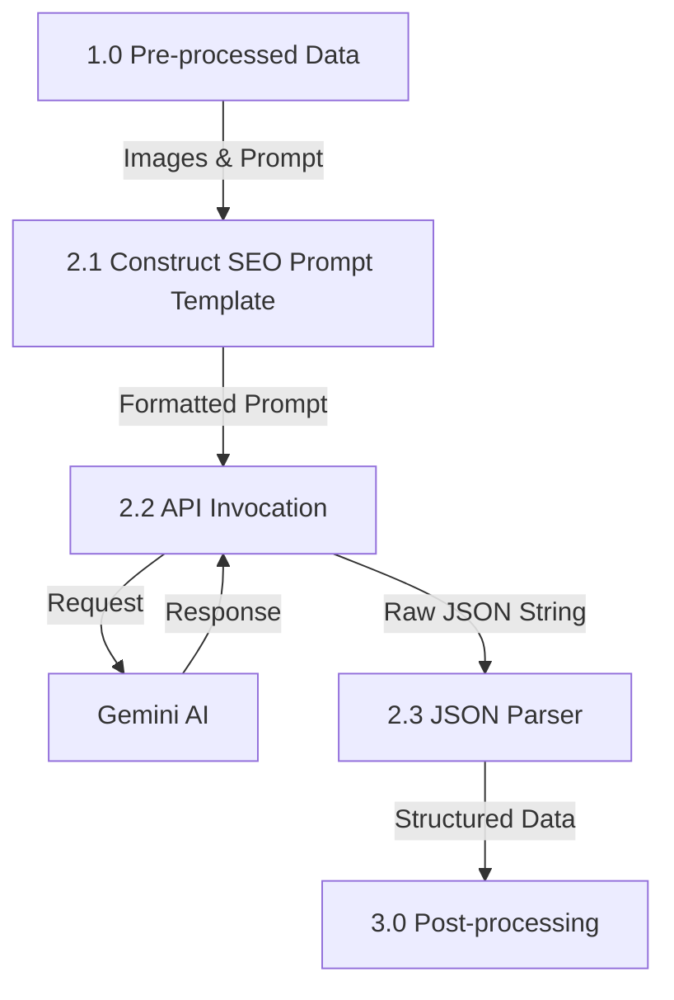
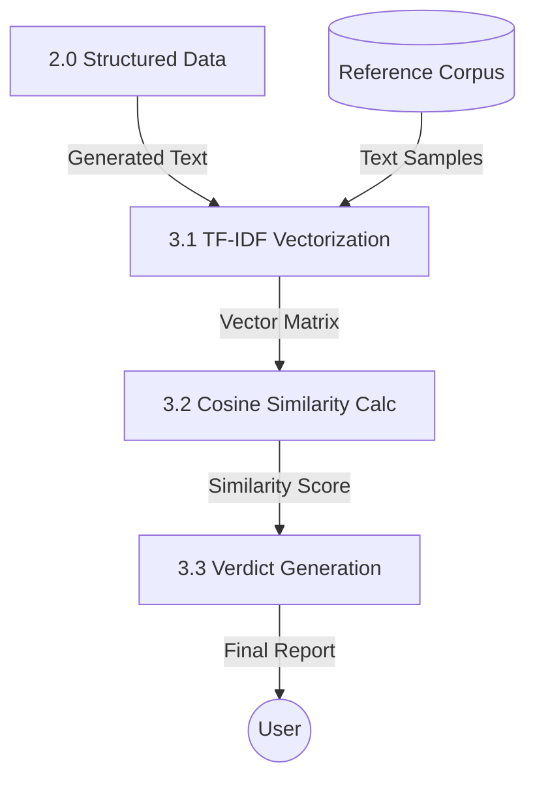

# SEO Suite Project Diagrams

This document contains the Flow Chart and Data Flow Diagrams (DFD) for the SEO Suite project, suitable for a college presentation.

## 1. Flow Chart
The flow chart illustrates the logical sequence of operations for generating SEO-optimized content.

---

## 2. Data Flow Diagrams (DFD)

### Level 0: Context Diagram
The Context Diagram shows the system boundary and its interactions with external entities.

---

### Level 1: Process Diagram
Level 1 breaks down the system into its primary functional processes.

---

### Level 2: Detailed Process Diagram
Level 2 provides a deeper look into the specific sub-processes.

#### 2.1 Content Generation (Decomposed Process 2.0)

#### 2.2 Plagiarism Checking (Decomposed Process 3.0)

