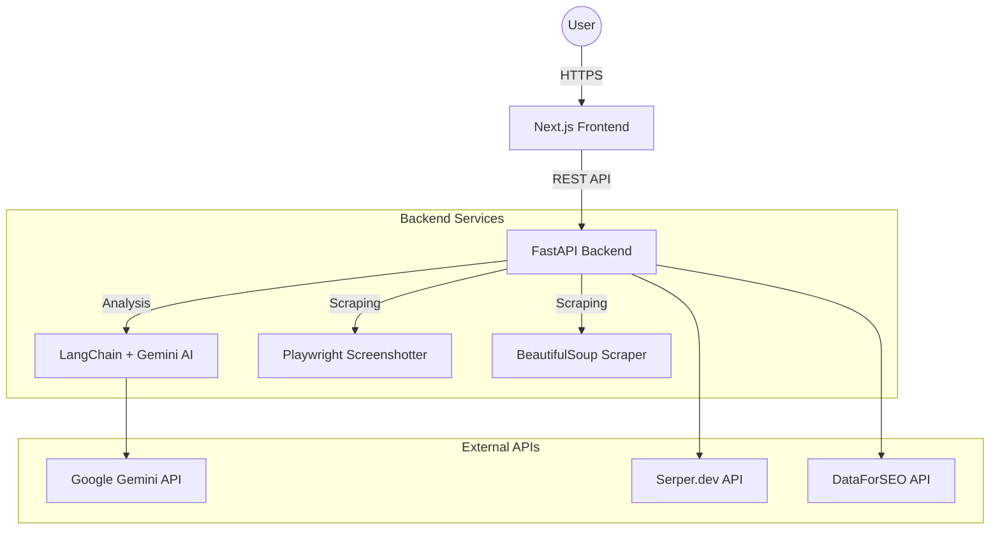
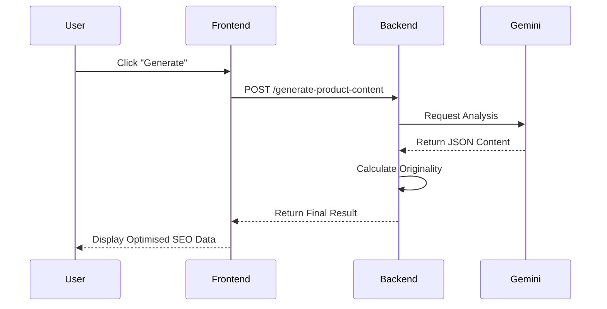
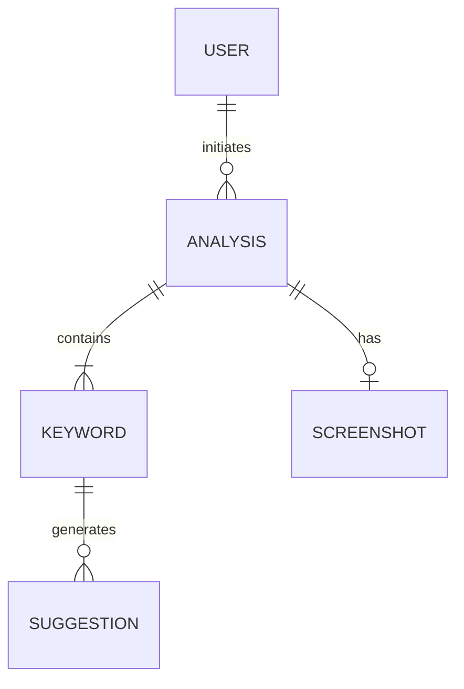

# AI SEO Suite: Presentation Content

This document provides structured content for your college PPT presentation based on your requested template.

---

## 2.4 Requirement Specifications

### 2.4.1 Functional Requirements
*As a user, I can...*
- **Analyze Keywords**: Research seed keywords to get volume, competition, and CPC data.
- **Generate AI Content**: Create SEO-optimized product descriptions and blog posts using Gemini AI.
- **Audit Websites**: Input a URL to receive a technical SEO summary and performance screenshot.
- **Check Plagiarism**: Verify the uniqueness of generated content against reference data.
- **Analyze SERP**: Gain insights into search engine result pages to identify ranking opportunities.
- **Visualize Clusters**: View keywords grouped into logical clusters with strategic recommendations.

### 2.4.2 Non-Functional Requirements
- **Performance**: Backend utilizes asynchronous processing (`FastAPI` + `aiohttp`) to ensure low latency even when calling multiple external APIs.
- **Security**: Secure handling of API keys (Gemini, Serper.dev) using environment variables and Pydantic-based configuration.
- **Scalability**: Microservice-ready architecture where the frontend and backend are decoupled, allowing independent scaling.
- **Availability**: Integration of multiple fallback sources (Google Autocomplete, DuckDuckGo) ensures high availability even if primary APIs fail.

---

## 3. TECHNOLOGY STACK & ARCHITECTURE

### 3.1 System Architecture Diagram



### 3.2 Technology Stack

#### 3.2.1 Frontend
- **Framework**: Next.js 14+ (App Router)
- **Styling**: Tailwind CSS (Premium Dark Theme)
- **Icons**: Lucide React
- **Runtime**: Bun / Node.js

#### 3.2.2 Backend
- **Framework**: FastAPI (Asynchronous Python)
- **AI Orchestration**: LangChain
- **LLM**: Google Gemini 2.5 Flash Lite
- **Scraping/Screenshot**: Playwright & BeautifulSoup4
- **Data Handling**: Pydantic v2

#### 3.2.3 Database
- **Current**: In-memory Caching / Session-based
- **Production Ready**: Architecture supports Redis (for high-speed caching) and PostgreSQL (for user data).

#### 3.2.4 Tools
- **IDE**: VS Code
- **Version Control**: GitHub
- **Testing**: Postman / Swagger UI (`/docs`)
- **Package Manager**: Bun (Frontend), Pip (Backend)

### 3.3 Justification of Technology
- **FastAPI**: Chosen for its high performance and native support for `async/await`, essential for handling concurrent API requests.
- **Next.js**: Provides Excellent SEO for the tool itself and a smooth, reactive user experience.
- **Gemini AI**: Offers a cost-effective yet powerful alternative to OpenAI for high-context SEO analysis.
- **Playwright**: Unlike static scrapers, it handles JavaScript-heavy websites for accurate screenshots/audits.

---

## 4. SYSTEM DESIGN

### 4.1 UML Diagrams

#### 4.1.1 Use Case Diagram
```mermaid
useCaseDiagram
    actor "Digital Marketer" as User
    actor "Gemini AI" as AI
    actor "Serper.dev" as SearchAPI

    package "AI SEO Suite" {
        usecase "Generate SEO Content" as UC1
        usecase "Perform Keyword Research" as UC2
        usecase "Website Audit" as UC3
        usecase "Check Plagiarism" as UC4
    }

    User --> UC1
    User --> UC2
    User --> UC3
    User --> UC4
    
    UC1 --> AI
    UC2 --> SearchAPI
    UC3 --> AI
```

#### 4.1.2 Activity Diagram (Content Generation)
```mermaid
activityDiagram
    start
    :User uploads image/URL;
    :Backend captures screenshot;
    :AI Analyzes image & context;
    if (Success?) then (yes)
        :Generate SEO Content;
        :Run Plagiarism Check;
        :Display Originality Score;
    else (no)
        :Show Error Message;
    endif
    stop
```

#### 4.1.3 Sequence Diagram


#### 4.2 Database Design
#### 4.2.1 E-R Diagram (Conceptual)

